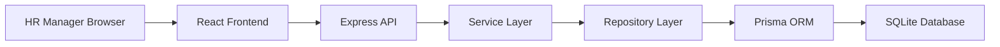
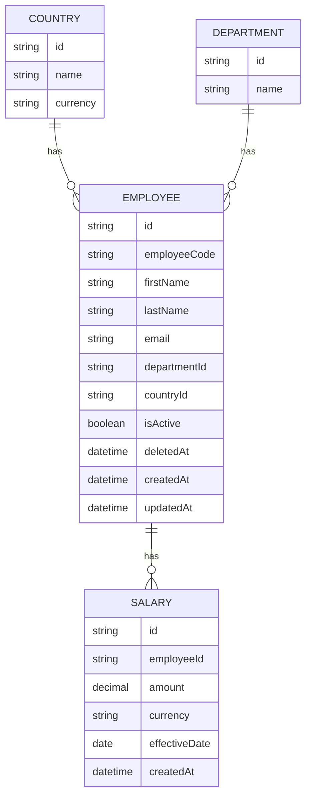

# ACME Salary Insights Architecture

## High Level Architecture

ACME Salary Insights is a web application with a React frontend, an Express API backend, and a SQLite database accessed through Prisma ORM.

The application is intentionally split into clear layers:

- Frontend: renders HR workflows, forms, filters, tables, and dashboards.
- API routes: expose HTTP endpoints and translate requests into service calls.
- Service layer: owns business rules and application use cases.
- Repository layer: owns persistence queries and Prisma access.
- Database: stores countries, departments, employees, and salary history.



Authentication, authorization, payroll processing, currency conversion, and multi-tenancy are out of scope.

## Frontend Architecture

The frontend uses React, Vite, TypeScript, Chakra UI, React Router, TanStack Query, React Hook Form, and Zod.

Primary frontend responsibilities:

- Provide the application shell with sidebar navigation and HR Manager navbar greeting.
- Render employee listing, search, filters, pagination, and CRUD workflows.
- Render employee details and salary history.
- Render payroll analytics and charts.
- Validate form input before submission.
- Use TanStack Query for API reads, mutations, cache updates, and loading/error states.

Expected structure:

```text
frontend/
  src/
    app/
    components/
    features/
      employees/
      salaries/
      analytics/
    lib/
    routes/
```

The frontend should keep business rules light. Salary immutability, soft deletion, filtering semantics, and analytics calculations belong in the backend.

## Backend Architecture

The backend uses Node.js, Express, TypeScript, Zod, Prisma ORM, and SQLite.

Primary backend responsibilities:

- Expose REST APIs for employee, salary, and analytics workflows.
- Validate request input with reusable schemas.
- Enforce business rules in services.
- Keep Prisma access behind repositories.
- Return predictable API responses for frontend consumption.

Expected structure:

```text
backend/
  src/
    app.ts
    server.ts
    modules/
      employees/
      salaries/
      analytics/
    shared/
      validation/
      errors/
      prisma/
  prisma/
    schema.prisma
    seed.ts
```

Routes should stay thin. They should parse request data, call services, and translate results or errors into HTTP responses.

Services should contain use-case logic such as:

- Creating employees.
- Preventing duplicate employee emails.
- Searching and filtering employees.
- Soft deleting employees.
- Creating new salary records instead of mutating history.
- Calculating current salary from the latest effective date.
- Producing analytics from current salaries.

Repositories should contain database access details such as Prisma queries, filters, pagination, includes, and aggregations.

## Database Design

SQLite is the assessment database. Prisma provides schema definition, migrations, generated client types, and database access.

Core tables:

- countries
- departments
- employees
- salaries

Database design priorities:

- Enforce unique employee email and employee code.
- Model employee relationships to department and country.
- Store salary history as append-only records.
- Support soft delete through `isActive` and `deletedAt`.
- Support efficient employee listing through pagination and filters.

Current salary is not stored as a mutable field on Employee. It is derived from the employee's latest salary record by `effectiveDate`.

## Domain Model

The domain centers on employees and immutable salary history:



Salary history is immutable. Any salary update creates a new Salary record, preserving previous salary records for auditability and historical reporting.
