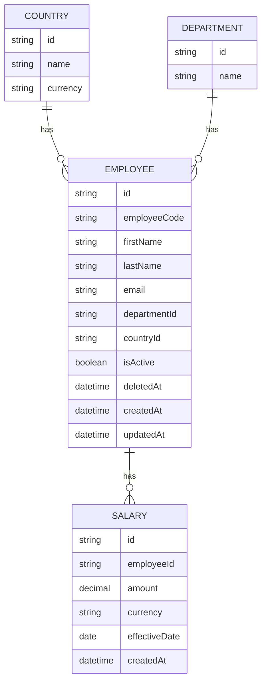

# ACME Salary Insights Domain Model

## Overview

The ACME Salary Insights domain models the organization structure, employee records, and salary history needed by an HR Manager.

The core entities are:

- Country
- Department
- Employee
- Salary

Employees belong to one department and one country. Employees can have many salary records. Salary records are immutable and represent the salary history for an employee.

## Entity Relationship Diagram

## Country

A Country represents an employee location and the currency used for salary records in that location.

Fields:

- `id`: unique identifier.
- `name`: country name.
- `currency`: local salary currency.

Seed countries:

- India
- United States
- United Kingdom
- Germany
- Singapore

Relationships:

- A Country has many Employees.

## Department

A Department represents an organizational unit.

Fields:

- `id`: unique identifier.
- `name`: department name.

Seed departments:

- Engineering
- Product
- HR
- Finance
- Sales

Relationships:

- A Department has many Employees.

## Employee

An Employee represents a person whose employment and salary information is managed by HR.

Fields:

- `id`: unique identifier.
- `employeeCode`: unique internal employee code.
- `firstName`: employee first name.
- `lastName`: employee last name.
- `email`: unique employee email address.
- `departmentId`: department reference.
- `countryId`: country reference.
- `isActive`: active status used for soft deletion.
- `deletedAt`: timestamp set when the employee is soft deleted.
- `createdAt`: creation timestamp.
- `updatedAt`: last update timestamp.

Relationships:

- An Employee belongs to one Department.
- An Employee belongs to one Country.
- An Employee has many Salary records.

Rules:

- `employeeCode` must be unique.
- `email` must be unique.
- Deleted employees are soft deleted by setting `isActive` to false and `deletedAt` to a timestamp.
- Soft deleted employees should not appear in default employee listings.

## Salary

A Salary represents a salary amount for an employee starting on a specific effective date.

Fields:

- `id`: unique identifier.
- `employeeId`: employee reference.
- `amount`: salary amount.
- `currency`: currency for the salary amount.
- `effectiveDate`: date when this salary becomes effective.
- `createdAt`: creation timestamp.

Relationships:

- A Salary belongs to one Employee.

Rules:

- Salary history is immutable.
- Updating an employee salary creates a new Salary record.
- Existing Salary records should not be modified to represent a salary change.
- The current salary is the Salary record with the latest `effectiveDate` for an employee.

## Analytics Model

Analytics are calculated from employee and salary data.

Current-salary analytics should use each active employee's latest salary record by `effectiveDate`.

Required metrics:

- Total payroll.
- Average salary.
- Payroll by country.
- Payroll by department.
- Top paid employees.
- Salary distribution.

Salary distribution bands:

- 0-50k
- 50k-100k
- 100k-150k
- 150k-200k
- 200k+

## Seed Data Rules

Development seed data must include:

- 10,000 employees.
- 5 departments.
- 5 countries.
- At least one Salary record for every Employee.
- Unique employee emails.
- Unique employee codes.

Seed data should be large enough to exercise search, filters, pagination, salary history, and analytics behavior.
